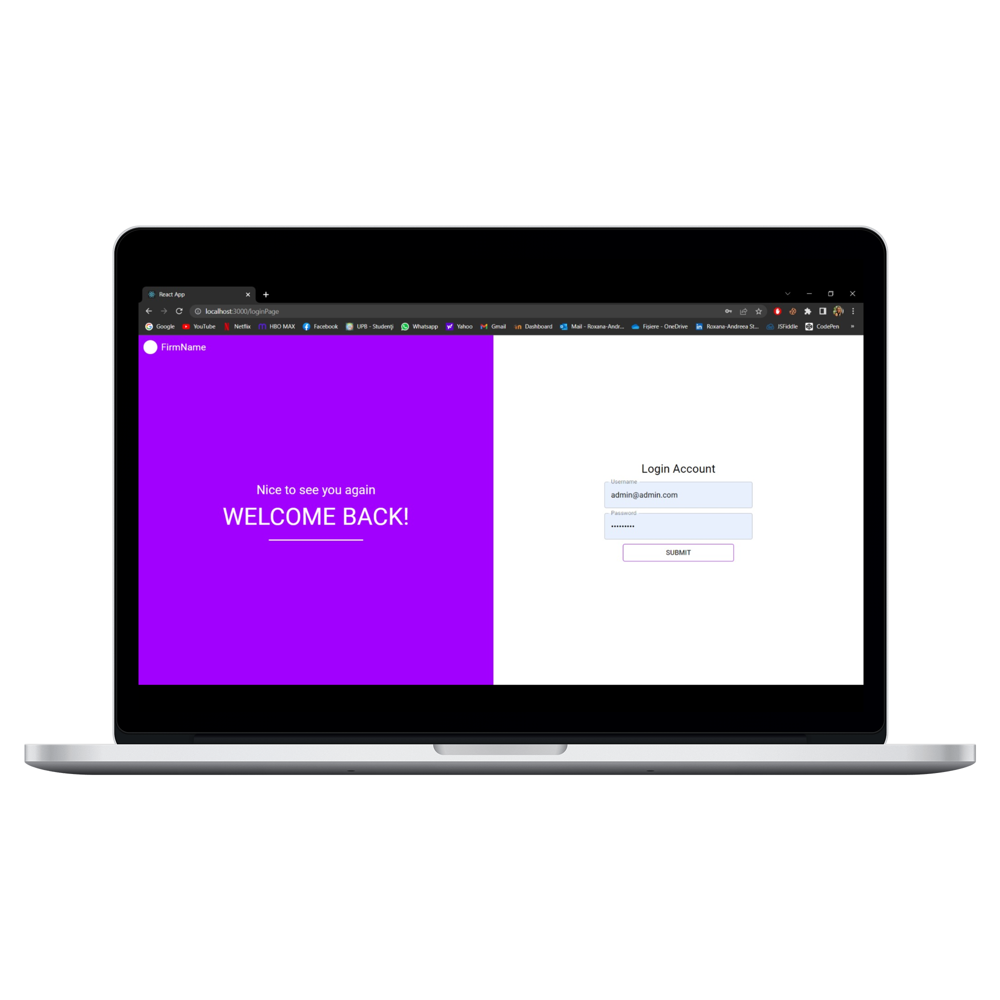
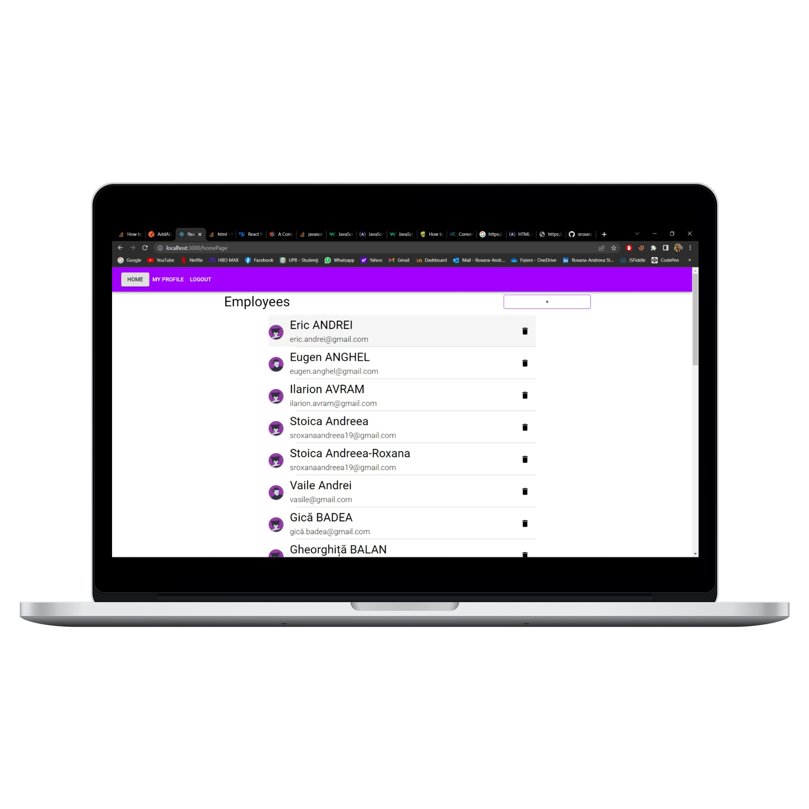
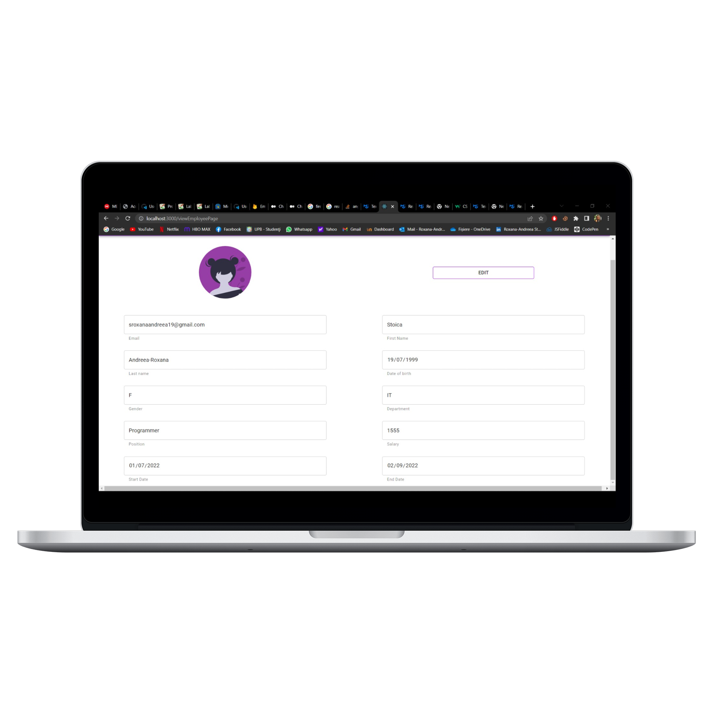
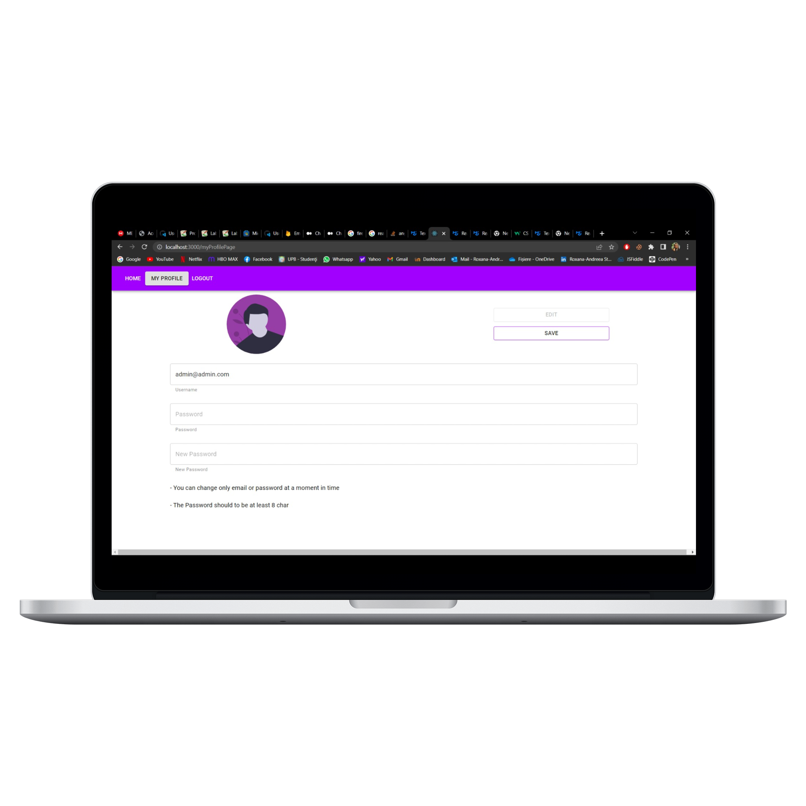
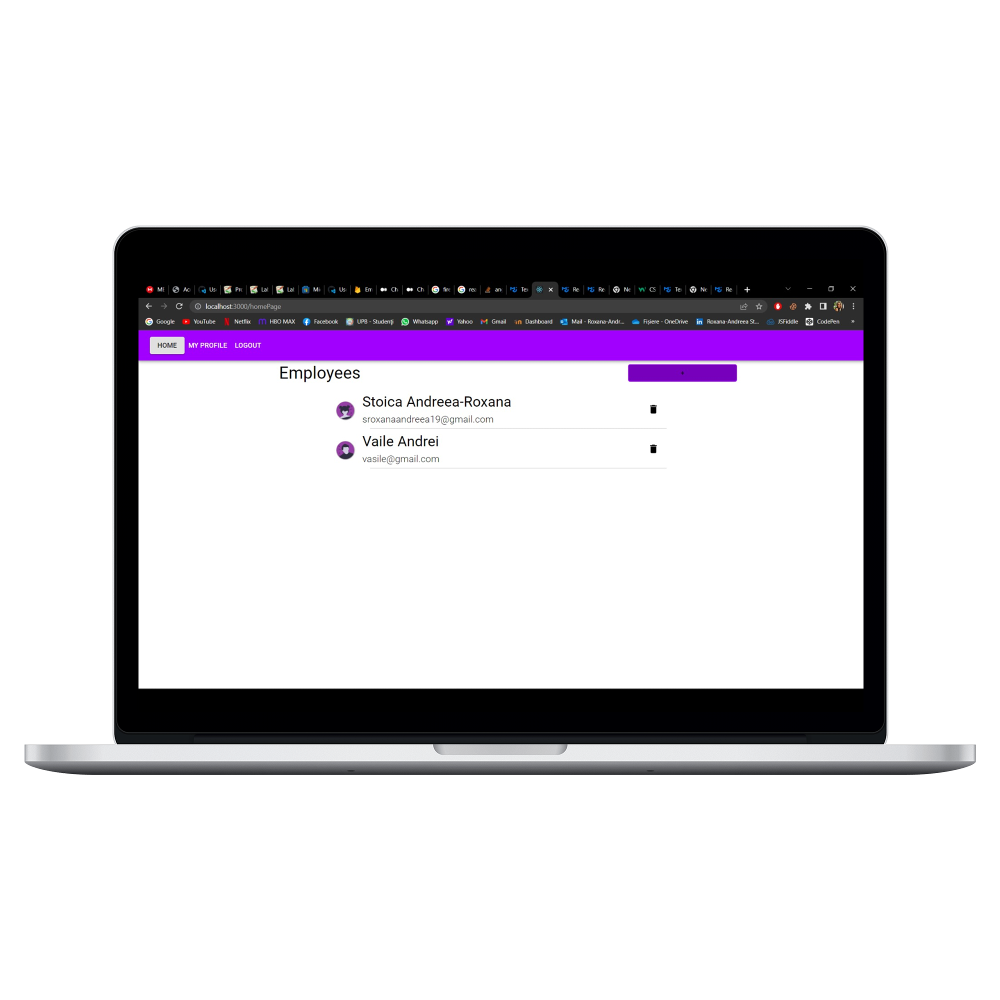
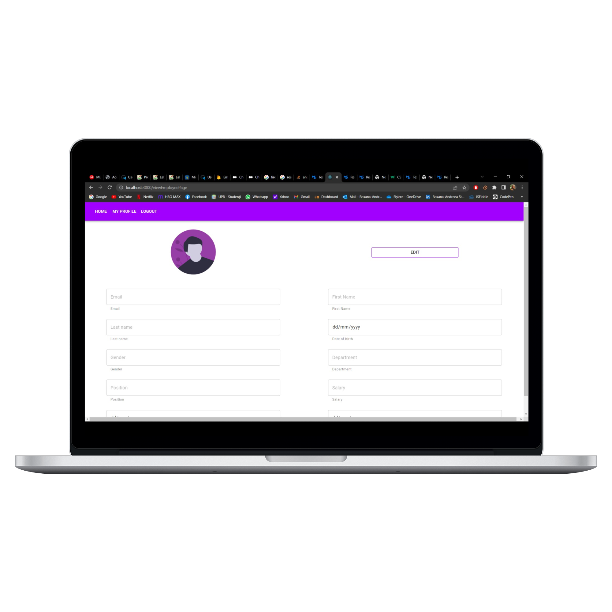
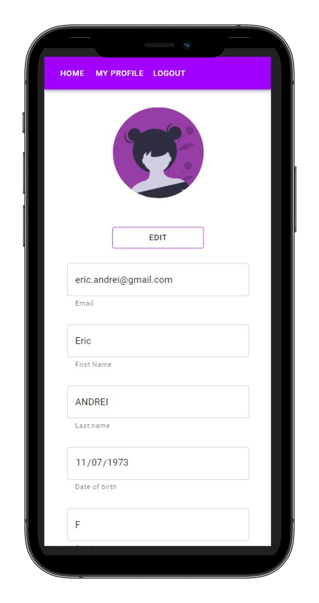
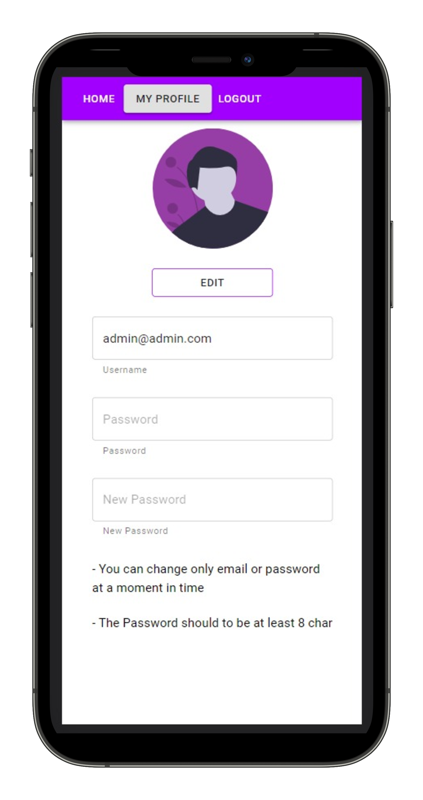

# Management of employees

The application is owned by the HR manager of a company for the centralization of all company employees. The hr manager is responsible to update every time in the web app when someone is joining or leaving. The main role for the application is 'administrator'.  
 
The webb application includes the following pages:

- Login
- Home
- My Profile
- Edit profile
- View Profile

The main menu is placed in the header, containing 3 options: Home, My Profile and Logout. In the home page are listed all the employees currently stored in the database and the actions like: "Add", "View", "Edit", "Delete" employee.  
In Home page there are maximum 25 employees shown and also paginations is included.
 
In My profile page the user is able to update their information, including the credentials for login.

 
The technologies and frameworks used are:

- ReactTS
- Express with NodeJS
- MongoBD for storage
- FirebaseAuth for authentication

## Desktop Demo

## Mobile Demo

